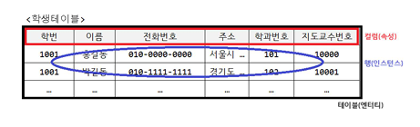

# 1-1. 데이터 모델의 이해

## 모델링의 개념

- 모델링(Modeling)은 **현실 세계의 비즈니스 프로세스와 데이터 요구 사항**을 추상적이고 구조화된 형태로 표현하는 과정이다.
- 즉, 현실에서 발생하는 업무와 데이터를 그대로 DB에 옮겨 담을 수 없으므로, **데이터베이스에서 사용할 수 있는 구조와 관계로 재해석**하는 작업이다.
- 데이터 모델링을 통해 데이터의 **저장, 조작, 관리 방법**이 명확해지며, 데이터베이스 설계의 기초가 된다.
---

## 모델링의 특징
모델링 과정에는 다음과 같은 세 가지 중요한 성격이 있다.

### 1. 단순화 (Simplification)
- 현실 세계의 복잡한 현상을 모두 다룰 수는 없으므로, **핵심 요소에 집중**하고 불필요한 세부사항은 제거한다.
- 단순화를 통해 **복잡한 현실을 이해하기 쉬운 구조**로 만들 수 있다.
- 예) 고객 관리 시스템에서 고객의 혈액형이나 취미 같은 불필요한 속성은 제거하고, 고객ID, 이름, 연락처만 남기는 것.

### 2. 추상화 (Abstraction)
- 현실 세계를 일정한 **표기법과 형식**에 따라 간략히 표현하는 것.
- 다양한 현상과 데이터를 **엔터티, 속성, 관계** 등 데이터 모델 요소로 바꿔 기술한다.
- 예) ‘직원은 부서에 속한다’라는 현실을 ERD에서 **사각형(직원), 사각형(부서), 선(관계)**로 표현.

### 3. 명확화 (Clarity)
- 대상을 표현할 때 애매함을 없애고 **정확하게 기술**해야 한다.
- 이를 통해 모델을 공유하는 사람들(개발자, 설계자, 사용자) 사이의 **의사소통이 원활**해진다.
- 예) ‘고객’이라는 용어를 정의할 때, 단순 방문자까지 포함하는지, 실제 구매자만 포함하는지 명확히 해야 함.

---

## 데이터 모델링의 3가지 관점

1. **데이터 관점**
    - 데이터가 **어떻게 저장·접근·관리**되는지를 정의한다.
    - 데이터베이스 구조(테이블, 속성, 제약조건 등)를 중심으로 다룸.

2. **프로세스 관점**
    - 시스템이 **어떤 작업을 수행**하는지, 그리고 그 작업들이 어떻게 조직되고 조정되는지를 정의한다.
    - 데이터가 **시스템 내에서 어떻게 흐르고 변환되는지**를 확인한다.
    - 예) 주문이 들어오면 결제 → 배송으로 데이터가 흘러가는 과정.

3. **데이터와 프로세스 관점**
    - 데이터 관점과 프로세스 관점을 결합하여 **시스템 전체 동작을 이해**하는 단계.
    - 특정 프로세스가 어떤 데이터를 사용하고, 데이터가 어떻게 생성·변경되는지를 명확히 한다.
    - 예) “주문 처리 프로세스는 고객·상품 데이터를 사용하고, 새로운 주문 데이터를 생성한다.”

---

## 데이터 모델링 시 유의점

1. **중복 (Duplication)**
    - 동일한 정보를 한 테이블 또는 여러 테이블에 중복 저장하지 않도록 주의.
    - 중복 데이터는 불필요한 저장공간 차지 + 데이터 불일치 문제를 일으킨다.

2. **비유연성 (Inflexibility)**
    - 업무 변화가 있을 때마다 모델을 자주 바꿔야 하는 상황을 피해야 한다.
    - 데이터 정의는 **업무 프로세스와 분리**해 설계하여 유연성을 높인다.

3. **비일관성 (Inconsistency)**
    - 데이터베이스 내 정보가 서로 모순되거나 상반된 상태.
    - **데이터 간 관계를 명확히 정의**하고, 품질 관리가 필요하다.
    - 데이터 중복이 없어도 비일관성은 발생할 수 있음.
    - 예) 고객 주소가 한 테이블에는 “서울”, 다른 테이블에는 “Seoul”로 기록되어 있는 경우.  

---

## 데이터 모델링의 3가지 요소

1. **엔터티(Entity)**
   - 업무에서 관리해야 할 **대상(객체)**
   - 현실 세계의 사람, 사물, 사건 등을 의미
   - 예) 고객, 주문, 상품

2. **속성(Attribute)**
   - 엔터티가 가지는 **특징이나 성질**
   - 하나의 엔터티는 여러 속성을 가질 수 있다.
   - 예) 고객 엔터티 → 이름, 연락처, 주소

3. **관계(Relationship)**
   - 엔터티와 엔터티 사이의 **연관성**
   - “누가 누구와 어떤 관련이 있는가?”를 표현
   - 예) 고객 ―(주문한다)→ 주문, 주문 ―(포함한다)→ 상품

---

## 데이터 모델링의 3단계

1. **개념적 모델링 (Conceptual Modeling)**
   - **업무 중심적이고 포괄적인 모델링** 단계
   - 조직 전체의 데이터 요구사항을 분석 후 **핵심 엔터티와 관계**를 추출
   - 추상화 수준이 가장 높음 → ERD 작성
   - 예) 고객, 주문, 상품 같은 주요 개체를 식별하고 관계 연결

2. **논리적 모델링 (Logical Modeling)**
   - 개념적 모델링 결과를 토대로 **세부 속성, 식별자, 관계**를 정의
   - 데이터 정규화를 수행하여 중복 최소화
   - 동일한 논리적 모델은 여러 프로젝트에서 재사용 가능 → 유지보수 용이
   - 예) 고객 엔터티에 주민번호(식별자), 이름, 연락처 속성 추가

3. **물리적 모델링 (Physical Modeling)**
   - 논리 모델을 **실제 데이터베이스 구조**로 구현하는 단계
   - 데이터 저장 구조, 성능, 보안, 가용성 등 물리적 특성을 고려
   - 추상화 수준이 가장 낮음, 가장 구체적인 모델
   - 예) RDBMS 상에서 테이블, 인덱스, 파티션, 스토리지 방식 설계  

---

## 스키마의 3단계 구조

- **스키마(Schema)** : 데이터베이스의 구조와 제약 조건을 정의한 **메타데이터의 집합**
- 사용자의 관점과 실제 물리적 저장 방식을 분리하기 위해 고안됨
- ANSI-SPARC 3단계 구조로 외부·개념·내부 스키마로 나뉨

### 1. 외부 스키마 (External Schema)
- **사용자 관점**에서의 데이터베이스 구조
- 개별 사용자나 응용 프로그램이 **필요로 하는 데이터만**을 정의
- View(뷰) 형태로 표현됨
- 예) 한 직원이 자기 급여와 부서 정보만 볼 수 있도록 제한

### 2. 개념 스키마 (Conceptual Schema)
- 데이터베이스의 **전체 논리적 구조**
- 모든 사용자 관점을 통합한 스키마
- 데이터베이스에 존재하는 모든 **엔터티, 속성, 관계, 제약조건** 정의
- 예) 전체 조직 단위의 고객·주문·상품 구조를 포괄적으로 정의

### 3. 내부 스키마 (Internal Schema)
- 데이터가 **물리적으로 어떻게 저장되는지**를 정의
- 테이블, 인덱스, 파티션, 파일 구조 등
- DB 성능, 저장공간 효율, 보안 등을 고려

---

## 스키마 독립성

### 1. 논리적 독립성 (Logical Data Independence)
- **개념 스키마 변경**이 있어도 응용 프로그램이나 외부 스키마에 영향을 주지 않음
- 예) 고객 엔터티에 새로운 속성(예: 생년월일)을 추가해도 기존 프로그램은 수정 불필요

### 2. 물리적 독립성 (Physical Data Independence)
- **내부 스키마 변경**이 있어도 개념/외부 스키마에 영향을 주지 않음
- 예) 테이블을 다른 파일 그룹에 저장하거나 인덱스를 추가해도 응용 프로그램은 영향 없음  

---

## 데이터 모델 표기법 (ERD)

- **ERD(Entity Relationship Diagram)** : 엔터티(Entity)와 관계(Relationship)를 시각적으로 표현한 다이어그램
- 1976년 피터 첸(Peter Chen)이 제안한 E-R 모델이 표준으로 자리 잡음
- 데이터 모델링에서 가장 널리 사용하는 표기법

### ERD 주요 표기 요소
- **엔터티(Entity)** : 사각형(□)으로 표시
- **속성(Attribute)** : 타원형(◯)으로 표시, 엔터티와 선으로 연결
- **관계(Relationship)** : 마름모(◇)로 표시, 관련된 엔터티와 선으로 연결
- **식별자(Key Attribute)** : 밑줄(_)로 표시
- **참여도(Cardinality)** : 1:1, 1:N, N:M 형태로 관계 참여도를 나타냄

---

## ERD 작성 절차 (6단계)

1. **엔터티 도출**
   - 업무에서 관리해야 할 대상(객체)을 추출
   - 예) 고객, 주문, 상품

2. **엔터티 배치**
   - ERD 다이어그램에 엔터티들을 배치
   - 보통 상위 개체(주요 엔터티)를 상단/좌측에 배치

3. **엔터티 간 관계 설정**
   - 엔터티와 엔터티 사이의 관계를 선으로 연결
   - 예) 고객 — 주문, 주문 — 상품

4. **관계명 서술**
   - 관계를 설명하는 동사를 붙인다.
   - 예) 고객 —“주문한다”→ 주문

5. **관계의 참여도 기술**
   - 각 엔터티가 관계에 참여하는 수를 표시 (1:1, 1:N, N:M)

6. **관계의 필수 여부 확인**
   - 관계가 반드시 존재해야 하는지(필수), 선택적으로 존재할 수 있는지(선택)를 정의
   - 예) 주문은 반드시 고객과 연결(필수), 고객은 주문 없이 존재 가능(선택)  
