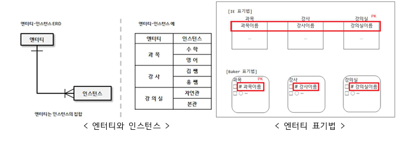

# 1-2. 엔터티 (Entity)

## 엔터티의 개념
- 현실 세계에서 **독립적으로 식별 가능한 객체나 사물**을 나타냄
- 업무적으로 분석하고 관리해야 하는 대상(Instance)들의 집합
- 인스턴스(Instance)는 엔터티의 구체적 사례로, 속성 값들의 집합으로 표현됨

### 예시: 엔터티, 속성, 인스턴스 관계
- **엔터티(Entity)** : 학생(Student)
- **속성(Attribute)** : 학번, 이름, 학과
- **식별자(Identifier)** : 학번 (고유값으로 각 학생을 식별)
- **인스턴스(Instance)** : 특정 학생 데이터
    - 학번: 2021001
    - 이름: 홍길동
    - 학과: 컴퓨터공학

---

## 엔터티의 특징
1. **유일한 식별자에 의해 식별 가능**
    - 인스턴스는 반드시 유일한 식별자(Primary Key)로 구분되어야 한다.
    - 예) 이름은 동명이인이 존재하므로 식별자로 부적합, 학번·사번이 고유식별자로 적절

2. **업무에 필요하고 관리할 정보**
    - 설계 대상 시스템 구축에 필요한 엔터티여야 한다.
    - 예) 학교 관리 시스템에는 학생 엔터티가 필요하지만, 병원 관리에는 불필요

3. **인스턴스들의 집합**
    - 엔터티는 2개 이상의 인스턴스로 구성되는 집합이어야 한다.
    - 인스턴스가 1개만 존재한다면 엔터티로 보기 어렵다.

4. **반드시 속성을 가짐**
    - 각 엔터티는 최소 2개 이상의 속성을 가진다.
    - 하나의 인스턴스는 각 속성에 대해 정확히 하나의 속성값을 가진다.
    - 예) 학생 엔터티의 인스턴스는 이름 속성에 단 하나의 이름 값만을 가진다.

5. **업무 프로세스에 의해 이용됨**
    - 실제 업무에서 사용되지 않는 엔터티는 잘못 설계된 것.
    - 상관 모델링이나 프로세스 검증 과정에서 **고립 엔터티**를 찾아내 제거해야 함.

6. **다른 엔터티와 최소 1개 이상의 관계 성립**
    - 엔터티는 반드시 다른 엔터티와 연관성을 가진다.
    - 관계가 전혀 없는 엔터티라면 도출 과정에 문제가 있거나 불필요한 엔터티일 수 있다.

---

## 엔터티의 분류

### 1) 유형/무형에 따른 분류
- **유형 엔터티**
    - 물리적 형태가 있는 실체
    - 안정적이고 지속적으로 활용
    - 예: 사원, 물품, 강사

- **개념 엔터티**
    - 물리적 형태 없음, 관리할 **개념적 정보**
    - 예: 조직, 보험상품

- **사건 엔터티**
    - 업무 수행에 따라 발생
    - 발생량이 많고 통계자료로 활용
    - 예: 주문, 청구, 미납

---

### 2) 발생 시점에 따른 분류
- **기본 엔터티 (Fundamental Entity)**
    - 해당 업무에서 원래 존재하는 정보
    - 독립적으로 생성, 다른 엔터티의 부모 역할
    - 고유 주식별자를 가짐 (다른 엔터티로부터 상속하지 않음)
    - 예: 사원, 부서, 고객, 상품

- **중심 엔터티 (Central Entity)**
    - 기본 엔터티로부터 발생하며 해당 업무의 중심적 역할
    - 많은 데이터가 발생, 다양한 행위 엔터티와 연결
    - 예: 계약, 사고, 청구, 주문, 매출

- **행위 엔터티 (Active Entity)**
    - 두 개 이상의 부모 엔터티로부터 발생
    - 자주 변경되거나 데이터 양이 증가
    - 상세 설계 단계나 상관 모델링 과정에서 도출
    - 예: 주문(고객+상품), 사원변경이력, 사고이력

---

## 엔터티의 명명 규칙
1. 현업에서 사용하는 용어를 사용
2. 약어 사용은 가급적 자제
3. 단수 명사 사용 (예: 학생, 고객)
4. 모든 엔터티명은 유일해야 함
5. 엔터티의 생성 의미를 반영하여 이름 부여

---

## 엔터티와 인스턴스 표기법
- **엔터티(Entity)** : ERD에서 **사각형(□)** 으로 표현
- **속성(Attribute)** : 보통 타원형(○)으로 연결
- **인스턴스(Instance)** : 엔터티의 실제 데이터 레코드  

